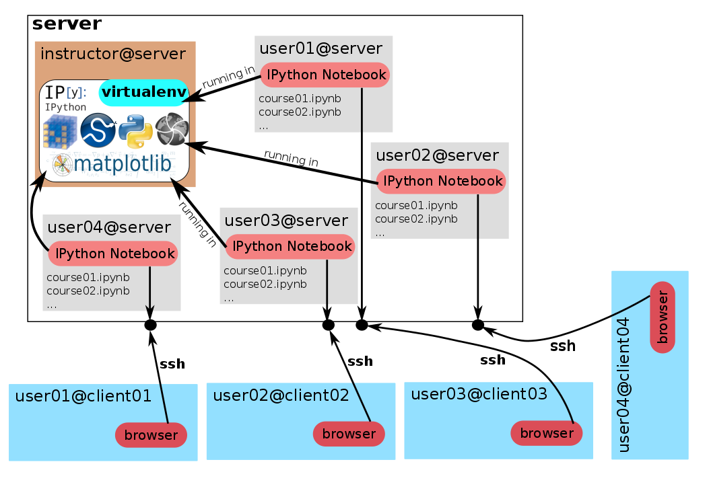

Client-server setup for IPython-Notebook based courses
======================================================




 | <a href="#rationale">Rationale</a>
 | <a href="#benefits">Benefits</a>
 | <a href="#drawbacks">Drawbacks</a>
 | <a href="#quickstart">Quickstart</a>
 | <a href="#requirements">Requirements</a>
 | <a href="#personal-laptops">Personal Laptops</a>
 | <a href="#nomenclature">Nomenclature</a> |


Rationale
---------

Depending on the Python-ecosystem used in a course, it can be tricky
and time-consuming to set up individually all computers to be used by
the participants. The client-server setup presented here requires from
the *clients*, usually the machines in a computer-lab and/or personal
laptops, no setup that isn't included in most standard modern
operating systems. The IPython-interpreters and -Notebooks (one for
each client) are run from one virtual environment (*virtualenv*) on a
central server. The setup exploits the web-based nature of the IPython
Notebook in that the participants only interact with a browser.

Benefits
--------

+ Little set-up time required.

+ Additional modules for a course are installed once and become
  immediately accessible to all participants.

+ The server-setup can be kept for the next course.

+ All participants work in exactly the same environment.

Drawbacks
---------

+ Participants don't necessarily leave with a Python installation on
  their laptops that would allow them to continue programming after
  the course. This could be remedied by offering an after-course
  installation event.

    

Quickstart
----------

1. Check that your computing infrastructure fulfils the [Requirements](#requirements).

2. Create one account on each computer-lab [client](#client-m),
   exclusively to be used for the course. The usernames should be
   different on each machine and will correspond to one (or a team of
   two) participants. These accounts need passwords.
   
3. Log into an [administration account](#admin-acc) on the [server](#server).

4. Clone the repository on github, e.g.:   

	``` {.bash}
	git clone https://github.com/C2SM/ipython-workshop-setup.git ./setup
    ```

	or click the "Download ZIP" - button on the
    [GitHub page](https://github.com/C2SM/ipython-workshop-setup) and
    uncompress.

5. Modify the file `clients-template.txt` and save it as `clients.txt`. The format of the file is:

	+ The first line contains `instructor_un@server`, where
      "`instructor_un`" is a username for a special ("instructor")
      account on the [server](#server), and "`server`" stands for its
      FQDN, e.g., "`climserv.dept.university.ch`".
    + From the second line on, the first row contains
      `participantX@clientX`, where "`participantX`" stands for a
      participant's username and "`clientX`" stands for the
      corresponding [client-machine](#client-m),
      e.g. "`part05@client05.mylab.mydomain.tld`".
	+ The second row contains the corresponding passwords (of the client accounts).
	+ The third row contains "`participantX@server`", indicating the
      accounts on the [server](#server), which correspond to the
      client accounts. **These accounts will be generated automatically!**.
	+ Include participants who bring their own laptop by writing
	  *personal_laptop* in the first column, an arbitrary dummy_password
	  in the second one (not used) and an ordinary client account
	  descriptor in the third column.
	+ **Fields (columns) are separated by exactly one space!**
	+ You can include a line that associates the instructor-account on
      the [server](#server) with a client-machine account. This way you (as
      instructor) will have a setup identical to the participants. Do
      this by adding the appropriate line anywhere below the first
      line.

6. Run `mk_server_accounts.sh`. This will create the instructor- and
   participant-accounts on the server, install a
   [*virtualenv*](https://virtualenv.pypa.io/en/latest/) in the
   instructor-account, and install the necessary packages in this
   *virtualenv* ("necessary packages" as defined in
   `requirements.txt`).

7. Run `cpkeys.sh`. This will create ssh key pairs on the clients, and
   copy the public key to `.ssh/authorized_keys` in the respective
   accounts on [server](#server).

8. Run `clientprep.sh`. This will customize the `startup_template.txt`
    and copy it as `startup.sh` into each client's $HOME.

9. Copy your course Notebooks into the home-directories of the server-accounts.

10. Test the installation: Log into a [client](#client-m)-account and
   run `./startup.sh`. this should start an Ipython-Notebook instance
   in the *virtualenv* but on the corresponding
   [server](#server)-participant-account, do the ssh-forwarding thing,
   and - after some seconds - start Firefox pointed at the
   Notebook. Try simultaneously with different client accounts.


Requirements
------------

### Clients

+ The clients need only basic networking capabilities (ssh), a
    browser, a POSIX CLI (e.g. bash), and some standard POSIX
    utilities (sed, grep, cut, netstat). All OS X, Linux, FreeBSD, etc. systems
    should work out-of-the box. Windows clients would probably work
    with [Cygwin](https://cygwin.com/index.html) installed, but this
    is not (yet) tested. Let me know in case you find something out!

+ The (computer-lab) clients need to be reachable via `ssh` from the server

+ You need administrative powers on the (computer-lab) clients to be
    able to set up accounts.

### Server

+ The server needs a modern system-Python (it needs to match the
    versions of the modules you use in the course and the IPython-Notebook
	version).    
	**We assume that the path to the interpreter is `/usr/bin/python2.7`**.
	If that is not the case, please edit in `mk_server_accounts.sh` the line:
		```
		virtualenv -p /usr/bin/python2.7
		```

+ You need administrator rights on that server. You need to have an
  account that lets you do passwordless `sudo`.

+ The server must be reachable via `ssh` by the clients.


Personal Laptops
-----------------

There should have been created server-accounts for the laptop users.
(see the keyword *personal_laptop* in `clients.txt`).

1. Collect ssh public keys from the laptop-users. If necessary have them create a key-pair using `ssh-keygen`.

2. Move each public key to the file `$HOME/.ssh/authorized_keys` in the `$HOME` of respective server-account.

3. Copy `startup_template.txt` to `startup.sh` on each laptop client
    and replace "*\_\_user\_\_*" with the respective server-account
    (e.g. "`part08@cimserv.dept.university.tld`"), and replace
    "*\_\_instructor_home\_\_*" with the home directory of the instructor
    account on the server (e.g. `/home/instructor`).

A helper script to set up participants' personal laptops in a more
automated fashion is in the works.


Nomenclature
------------

<a name="client-m"></a>**client-machine**: A machine used by one or
two participants. Might be a computer-lab machine or a personal
laptop. Identified by FQDN, e.g., `client05.mylab.mydomain.tld`.

<a name="admin-acc"></a>**administration account**: An account that
lets you `sudo` to root-privileges non-interactively.

<a name="server"></a>**server**: A machine on which the Python
interpreter, Ipython, Notebook, and a virtual environment responding
to the necessities of the teaching material are installed. All
Notebook instances are run on this machine.
